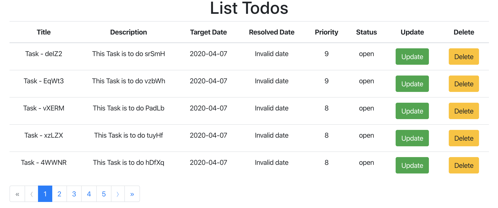
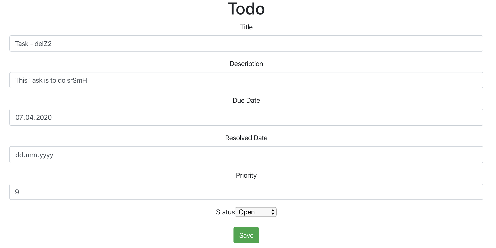

# Sample Microservices architecture for Scheduler application 

### Build Instruction
Project can be build by maven 
````
mvn clean verify
````

### Docker instruction
Build docker image
````
docker-compose build
````
Run Docker Images
````
docker-compose up
````

### Open Chrome
Open chrome or an browser with cors support for mac OS
````
open -n -a /Applications/Google\ Chrome.app/Contents/MacOS/Google\ Chrome --args --user-data-dir="/tmp/chrome_dev_test" --disable-web-security
````
#### Home Page
Open the [Home Page](http://localhost:4200/) and it looks like below<br/><br/>


You can delete the task by clicking `delete` button 
#### Update
You can click on `update` button to update the information, update page looks like

<br/>
### Sub-Projects information
This Project has 2 modules as below, know more about them by clicking below url<br/> 
[Scheduler App Service [BackEnd]](scheduler-app-service/README.md)<br/>
[Scheduler Web [FrontEnd]](scheduler-web/README.md)
```
.
├── scheduler-app-service 
    Default Port: 8081
├── scheduler-app-service
    Default Port: 4200
```
